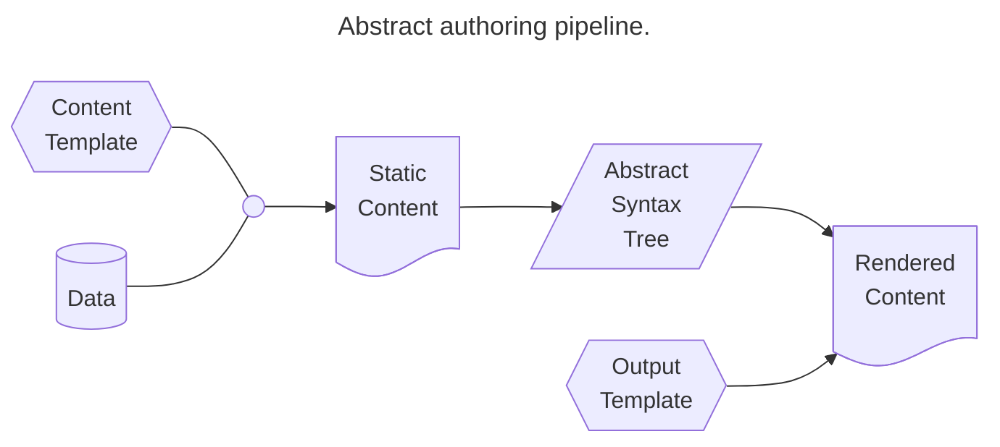
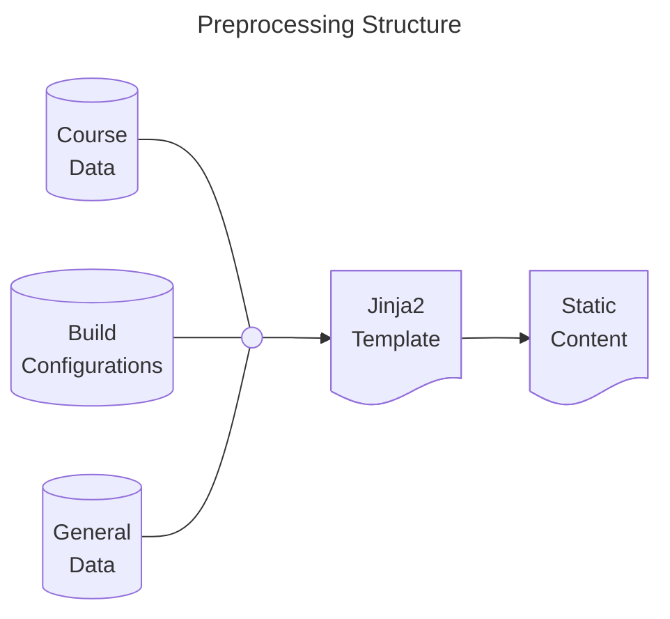
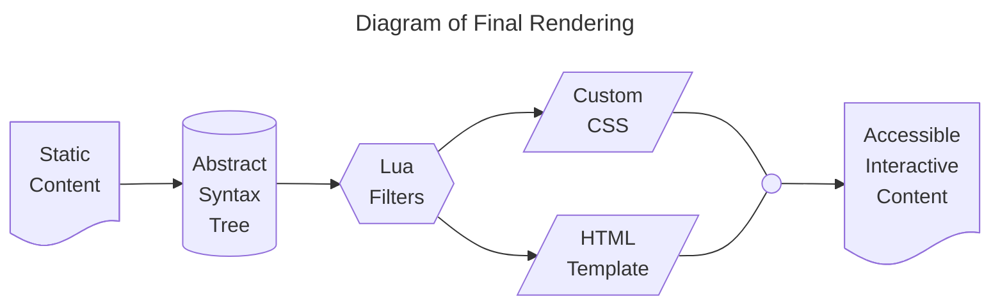

## {{page.title}}

<nav class="toc" aria-labelledby="toc-heading">
  <ul>
    <li id="toc-heading">Table of Contents
      <ul>
        <li><a href="#motivationtldr">Motivation and tl;dr</a></li>
        <li><a href="#preprocessing-to-static-markdown">Preprocessing to Static Markdown</a></li>
        <li><a href="#conversion-to-abstract-syntax-tree">Conversion to Abstract Syntax Tree</a></li>
        <li><a href="#rendered-output">Rendered Output</a></li>
        <li><a href="#future-development">Future Development</a></li>
      </ul>
    </li>
  </ul>
</nav>

> ### Motivation/tl;dr
> 
> Over the summer, I've developed a workflow and software to efficiently create and maintain course documentation (syllabus, glossary of terms, course notes, etc.) in response to the updated Title II of the Americans with Disabilities Act (ADA), which requires digital documents to meet WCAG 2.1 Level AA standards.
> 
> In summary, I author content using Markdown with Liquid tags to create templates for course documents. These are combined with YAML data/configuration files to generate well-structured static markdown. This static markdown can be used directly (viewed in Obsidian.md or similar) or turned into an Abstract Syntax Tree (AST) by conversion software such as Pandoc. This AST can then be converted into numerous other accessible formats — in particular, I'm generating WCAG 2.2 Level AA compliant HTML to post directly on D2L, my university's LMS.
> 
> The primary goal of any educational authoring system should be to separate data, static content, and final presentation, allowing authoring to focus on meaningful data and semantically meaningful content. This is the basic philosophy of many authoring pipelines, and it's *necessary* for generating and maintaining accessible content — a constantly moving target.
>
> More detailed design specifications are documented below, with example usage. Eventually I'd like to build a user-friendly front-end for this system so it could be adopted and used with minimal friction. If you're interested in using this and don't mind some CLI steps in the current closed beta version, [contact me by email](mailto:kris.hollingsworth@mnsu.edu).
{: .tldr }


<!-- @{ shape: doc, label: "Template" } -->
### Preprocessing to Static Markdown

Preprocessing is optional, and was initially inspired by the creation of this Jekyll powered website. You could directly author static content (.md, .tex, etc.), which is what I did initially for years. However, preprocessing makes it much easier to create and maintain materials (like updating links to university webpages that change location every academic year). You could also create templates in other formats, such as LaTeX, Jupyter Notebooks, or any other plaintext source file.



Currently, I use three configuration files:
1. **A Build Configuration File**
   - Settings configuration for build paths, pandoc options, conditional content inclusions or exclusion, etc.
2. **A Generic File for University and Instructor Level Data**
   - Web links for University Resources, my office number, contact information.
   - Data shared across courses (I maintain a library of MathQuill symbols for my interactive course notes here, for example.)
3. **Course Specific Data File(s)**
   - Course name, meeting times and locations, glossary of terms, course grading information, etc.
   - Currently, I maintain the course glossary of terms as a separate file for maintainability, but this isn't necessary and would likely be rolled into a single file once there's a more user-friendly front-end, as opposed to direct editing of the file.

This preprocessing step is optional, but it makes updating course documents between semesters highly efficient and provides a single source of truth to avoid missing any instances of information. For example, in my Calculus II syllabus I build the grading table from the data; here are the first four grade items.

#### `m122-course-data.yaml`
```yaml
grade_table:
  - activity: Attendance
    weight: 2%
    description: "Show up to class. On time. Attendance will be taken at the *beginning* of class."
  - activity: Foundations Assessment 1
    weight: 3%
    description: "Take-home, open resource review."
  - activity: Foundations Assessment 2
    weight: 3%
    description: "In-class assessment on Calculus I derivatives and integrals."
  - activity: Group Assessments
    weight: 5%
    description: "In class exploratory or review assessments completed in small teams. Assessment will be discussed more on Thursday of the first week, when the first group assessment occurs."
[...]
```
This is turned into a coherent markdown table in my syllabus template by:

#### `m122-syllabus-template.md`

```liquid
>[!info]- ## Grading Scheme
>
> | Activity | Weight | Description |
> | :---: | :---: | :-----------------: |
> | {{ item.activity }} | {{ item.weight }} | {{ item.description }} |
> Table: Course Grading Scheme
```


Combining the data with the template now generates the static Obsidian.md file:

#### `m122-syllabus.md`
```md
> [!info]- ## Grading Scheme
>
> | Activity | Weight | Description |
> | :---: | :---: | :-----------------: |
> | Attendance | 2% | Show up to class. On time. Attendance will be taken at the *beginning* of class. |
> | Foundations Assessment 1 | 3% | Take-home, open resource review. |
> | Foundations Assessment 2 | 3% | In-class assessment on Calculus I derivatives and integrals. |
> | Group Assessments | 5% | In class exploratory or review assessments completed in small teams. Assessment will be discussed more on Thursday of the first week, when the first group assessment occurs. |
[...]
```

Anywhere this information is referenced in any course document always points to the top-level data file and generates a static version during this preprocessing step, so I never have to worry about contradictory information being presented to students.

### Conversion to Abstract Syntax Tree

Once you have well-structured static content, Pandoc or Unified.js can be used to convert it to an Abstract Syntax Tree. This allows for a complete separation of content from presentation. With its limited syntax and formatting options, I've found Markdown to be a reliable, easy-to-learn method for creating this initial well-structured content.

Converting markdown to an AST reveals its semantic structure and content. For example, the grading table markdown from the previous section becomes:

#### `pandoc m122-syllabus.md -t native > output`

```scheme
Table
  ( "" , [] , [] )
  (Caption
      Nothing
      [ Plain
          [ Str "Course"
          , Space
          , Str "Grading"
          , Space
          , Str "Scheme"
          ]
      ])
  [ ( AlignCenter , ColWidth 0.1724137931034483 )
  , ( AlignCenter , ColWidth 0.1724137931034483 )
  , ( AlignCenter , ColWidth 0.6551724137931034 )
  ]
  (TableHead
      ( "" , [] , [] )
      [ Row
          ( "" , [] , [] )
          [ Cell
              ( "" , [] , [] )
              AlignDefault
              (RowSpan 1)
              (ColSpan 1)
              [ Plain [ Str "Activity" ] ]
          , Cell
              ( "" , [] , [] )
              AlignDefault
              (RowSpan 1)
              (ColSpan 1)
              [ Plain [ Str "Weight" ] ]
          , Cell
              ( "" , [] , [] )
              AlignDefault
              (RowSpan 1)
              (ColSpan 1)
              [ Plain [ Str "Description" ] ]
          ]
      ])
  [ TableBody
      ( "" , [] , [] )
      (RowHeadColumns 0)
      []
      [ Row
          ( "" , [] , [] )
          [ Cell
              ( "" , [] , [] )
              AlignDefault
              (RowSpan 1)
              (ColSpan 1)
              [ Plain [ Str "Attendance" ] ]
          , Cell
              ( "" , [] , [] )
              AlignDefault
              (RowSpan 1)
              (ColSpan 1)
              [ Plain [ Str "2%" ] ]
[...]
```

Clearly this isn't a *friendly authoring format*, but the AST can be interpreted and cleanly recreated in any number of accessible formats. As of the writing of this post, [Pandoc natively supports 50 input formats and 72 output formats](https://pandoc.org/MANUAL.html#general-options), as well as supporting custom readers and writers (for example, a [PreTeXt writer](https://github.com/oscarlevin/pandoc-pretext) is available here).

### Rendered Output

Since Obsidian.md syntax isn't currently natively supported by Pandoc, I also use a number of custom Lua filters to convert my AST into accessible formats (primarily .html).



Currently, I have 3 levels of Lua writers.
1. **Quality of Life Filters (QoL)** Optional filters that might be minor authoring experience improvements.
   - Capture current system/date time to embed in html template as update time.
   - Automatically generating page titles if blank.
2. **Obsidian Readers** Handles Obsidian specific syntax that doesn't translate natively in Pandoc.
   - Collapsible callouts get converted to `<details>` tags for HTML output, or non-collapsible sections for other writers.
   - Custom codefence writer for embedding interactive content such as [DoenetML](https://doenet.org) or [CalcPlot3d](https://c3d.libretexts.org/CalcPlot3D/index.html).
   - Update transcluded glossary terms to pop-up links for HTML output. Otherwise reduce them to highlighted keywords.
3. **WCAG Compliance** Fix minor WCAG 2.2 AA compliance issues.
   - Remove forced figure environments for images that don't need them.
   - Improve structure for Fieldsets.
   - Update Tables to include header/column scopes.

After this final conversion layer, the following WCAG 2.2 AA compliant output is generated. In the case of the grading table from our earlier examples code, the output is:


**Figure:** Image of rendered HTML (light-mode) output.

More examples can be found in my teaching samples. Currently there are two from Calculus II, but I'll continue to update and extend this list as I get more courses converted over to this authoring pipeline.
- Calculus 2: [Class 10: Area Between Curves](/assets/sample-teaching/10-lecture-area_between_curves.html)
- Calculus 2: [Class 17: Integration by Parts](/assets/sample-teaching/17-lecture-integration_by_parts.html)

### Future Development

Note that this process has already been through several iterations. Originally, I was only authoring static content, but I eventually added the preprocessing layer to improve maintainability from semester to semester. I've also continually improved and tweaked the styling of the final output while maintaining WCAG 2.2 AA compliance on the output layer. This is a major advantage of cleanly separating content from presentation, since the two can be worked on separately. This is an ongoing process, as I also have to spend time authoring content for my courses so I can provide free, open-source resources to my own students — but the key takeaway is that this separation should be one of the primary design goals of any system for accessible authoring. Any time you find yourself doing one-off styling instead of structurally solving a problem in your pipeline, that's likely a point that will fall out of compliance in the future or be difficult to maintain for both content and compliance.

For my personal pipeline, I plan on improving the process in several ways still. Eventual planned improvements include the following goals.

1. Expand custom writers for better generic AST conversion of Obsidian.md structure.
   - Improve support for Obsidian.md -> PreTeXt conversion.
2. Refactor code for efficiency, maintainability, and release to the OER community.
   - Release obsidian-doenet as community plugin. (Currently needs light code revisions and documentation.)
   - Refactor preprocessing to RUST.
3. Write custom theme or plugin for PreTeXt authoring in Obsidian.
   - Live course-note preview with template rendering without generating static-content.
   - Live preview of PreTeXt document
   - Schema validation.
4. Provide UI front-end for course document management, in particular data and configuration settings.
5. Package my own pedagogical UI as a turn-key solution for writing course notes through this, or similar, authoring pipelines.